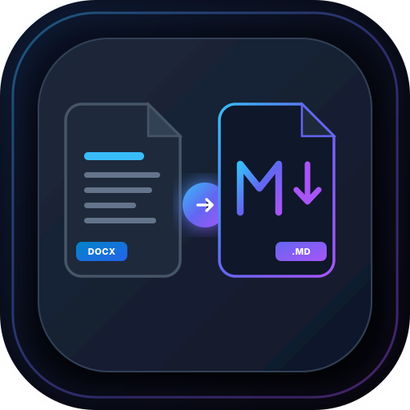

<p align="center">
  
</p>

<h1 align="center">Docx2Markdown</h1>

<p align="center">
  <b>Fast, Local-First Desktop Word (.docx) to GitHub Flavored Markdown Converter</b>
</p>

<p align="center">
  <a href="LICENSE"></a>
  
  <a href="https://www.electronjs.org/"></a>
  <a href="https://reactjs.org/"></a>
  <a href="https://www.typescriptlang.org/"></a>
  
</p>

---

## 📖 Ringkasan / Overview

**Docx2Markdown** adalah aplikasi desktop *local-first* modern berbasis Electron, React, dan TypeScript yang dirancang untuk mengonversi dokumen Microsoft Word (`.docx`) menjadi file **GitHub Flavored Markdown (GFM)** yang rapi, terstruktur, dan siap pakai tanpa membutuhkan perbaikan manual.

Aplikasi ini berjalan **100% secara lokal** di komputer Anda. Dokumen tidak pernah diunggah ke server cloud atau API pihak ketiga, menjaga privasi data Anda sepenuhnya.

---

## ✨ Fitur Utama

- 🔒 **100% Privat & Lokal:** Seluruh proses ekstraksi XML, penanganan gambar, dan rendering berjalan sepenuhnya di memori komputer Anda.
- 🖼️ **3 Mode Penanganan Gambar:**
  1. **Folder Gambar Terpisah (Default):** Mengekstrak gambar ke folder khusus (`./images/` atau nama kustom) dan dihubungkan via *relative path*.
  2. **Gambar Base64:** Menyematkan gambar langsung ke dalam file Markdown menggunakan Data URI Base64 (menghasilkan 1 file tunggal).
  3. **Tanpa Gambar:** Mengabaikan gambar untuk memperkecil ukuran file, dengan opsi mempertahankan teks caption sebagai *blockquote*.
- 🏷️ **Penamaan Gambar Cerdas dari Caption:** Mengambil nama file gambar otomatis dari Caption Word, Alt Text, atau Title. Dilengkapi pembersihan karakter khusus, slugifikasi, dan pencegahan duplikat nama (`-2`, `-3`).
- ⚡ **Preservation Struktur Dokumen Lengkap:**
  - **Heading:** H1–H6 (`#`..`######`) dengan deteksi peringatan lompatan level.
  - **Formatting Inline:** Bold (`**`), Italic (`*`), Strikethrough (`~~`), Inline code (`` ` ``), Hyperlink, Subscript (`<sub>`), Superscript (`<sup>`).
  - **Daftar (List):** Unordered (`-`), Ordered (`1.`), Nesting bertingkat, dan Checklist (`- [x]` / `- [ ]`).
  - **Tabel & Merged Cells:** Tabel standar dikonversi ke pipe table GFM, sedangkan tabel kompleks dengan sel digabung (*merged cells*) dikonversi otomatis ke tabel HTML (`<table>`).
  - **Footnote & Page Break:** Catatan kaki (`[^1]`), dan pemisah halaman (`---` atau komentar HTML).
  - **Daftar Isi (TOC):** Pembuatan Daftar Isi otomatis yang terhubung ke heading.
- 🎯 **Preset Konversi Siap Pakai:** Preset untuk **GitHub**, **Obsidian** (`./attachments/`), **Single-File**, dan **Text-Only**.
- 🖥️ **Split-View Interactive Workspace:** Editor *source code* Markdown yang dapat diedit langsung di panel kiri dengan *live rendered preview* GFM di panel kanan.
- 🔍 **Pencarian Teks & Edit Live:** Cari kata/frase di preview dan edit Markdown langsung sebelum disimpan.
- 📦 **Ekspor Fleksibel:** Simpan sebagai file tunggal `.md`, folder paket komplit, atau paket arsip `.zip`.
- 💾 **Penyimpanan Preferensi:** Menyimpan preferensi konfigurasi terakhir secara otomatis (*local storage*).

---

## 🛠️ Teknologi yang Digunakan

- **Desktop Framework:** Electron 34
- **Frontend Core:** React 18 + TypeScript + Vite 6
- **Styling & UI:** Tailwind CSS + Lucide Icons (Glassmorphic Dark Theme)
- **DOCX & XML Engine:** JSZip + Fast XML Parser
- **Markdown Preview:** React Markdown + Remark GFM + Rehype Raw
- **Packaging:** Electron Builder (NSIS Windows Installer & Portable Executable)

---

## 📥 Cara Menginstal & Menjalankan

### Menggunakan Windows Executable Installer (.exe)
File installer Windows siap pakai tersedia pada folder `release/`:
- **Installer Setup:** `release/Docx2Markdown Setup 1.0.0.exe` (Disertai installer wizard & shortcut desktop).
- **Portable Version:** `release/Docx2Markdown 1.0.0.exe` (Langsung jalan tanpa perlu instalasi).

### Mode Pengembangan (Development)

1. **Clone Repositori:**
   ```bash
   git clone https://github.com/Wahyu-Siregar/Docx2Markdown.git
   cd Docx2Markdown
   ```

2. **Install Dependensi:**
   ```bash
   npm install
   ```

3. **Jalankan Aplikasi Mode Development:**
   ```bash
   npm run dev
   ```

4. **Kompilasi Biner Windows (.exe):**
   ```bash
   npm run dist
   ```

---

## 📂 Struktur Proyek

```text
Docx2Markdown/
├── electron/                  # Process Electron main & preload IPC
│   ├── main.ts                # Main process (Native Window, IPC, Filesystem)
│   └── preload.cts            # Preload context bridge (window.docx2mdApi)
├── public/                    # Aset Publik & Logo Vector SVG / PNG
│   ├── favicon.svg            # Favicon browser & app icon
│   ├── icon.svg               # Vector SVG logo utama
│   └── icon.png               # High resolution PNG logo (512x512)
├── src/
│   ├── components/            # Komponen UI React
│   │   ├── Header.tsx         # Bar header dengan badge privasi
│   │   ├── DropZone.tsx       # Drag-and-drop file picker
│   │   ├── FileSummaryPanel.tsx # Ringkasan statistik dokumen
│   │   ├── ImageModeSelector.tsx # Kartu opsi mode gambar A, B, C
│   │   ├── AdvancedOptionsDrawer.tsx # Drawer opsi kustom & Preset
│   │   ├── ConversionProgress.tsx # Bar indikator progres konversi
│   │   ├── PreviewWorkspace.tsx # Split-view live preview & pencarian teks
│   │   └── ConversionReportModal.tsx # Modal laporan statistik & warning
│   ├── core/                  # Engine AST & Logika Konversi
│   │   ├── docxParser.ts      # Parser XML DOCX ke Document AST
│   │   ├── imageProcessor.ts  # Slugifikasi caption & mode gambar
│   │   ├── markdownRenderer.ts# Renderer AST ke Markdown GFM & warning
│   │   ├── exporter.ts        # Ekspor folder & paket ZIP
│   │   └── validator.ts       # Validator integritas output
│   ├── types/                 # Tipe Data & Antarmuka TypeScript
│   │   ├── ast.ts             # Struktur data AST
│   │   └── config.ts          # Opsi konfigurasi & preset default
│   ├── App.tsx                # Kontroler aplikasi utama
│   ├── main.tsx               # Entrypoint React
│   └── index.css              # Styling Tailwind CSS & Glassmorphism
├── package.json
├── tailwind.config.js
├── tsconfig.json
└── vite.config.ts
```

---

## 📄 Lisensi

Proyek ini dirilis di bawah lisensi [MIT License](LICENSE).
